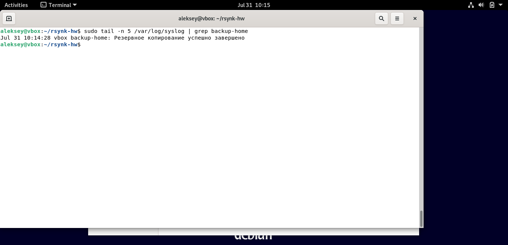

#Домашнее задание к занятию "Резервное копирование" - Андреев Алексей  
**Задание 1**  

### 1. Зеркальная копия с rsync

```bash
rsync -av --checksum --exclude=".*" /home/aleksey/ /tmp/backup/

```


**Задание 2**
### 2. Регулярное резервное копирование

## Скрипт: `/usr/local/bin/backup-home.sh`

```bash
#!/bin/bash
SOURCE="/home/aleksey/"
BACKUP="/tmp/backup/"
LOG_TAG="backup-home"

if [ ! -d "$BACKUP" ]; then
  logger -t $LOG_TAG "Ошибка: папка $BACKUP не существует"
  exit 1
fi

rsync -av --checksum --exclude=".*" "$SOURCE" "$BACKUP" > /tmp/backup.log 2>&1

if [ $? -eq 0 ]; then
  logger -t $LOG_TAG "Резервное копирование успешно завершено"
else
  logger -t $LOG_TAG "Ошибка при резервном копировании"
fi

rm -f /tmp/backup.log
```

[Crontab](Crontab.txt)





